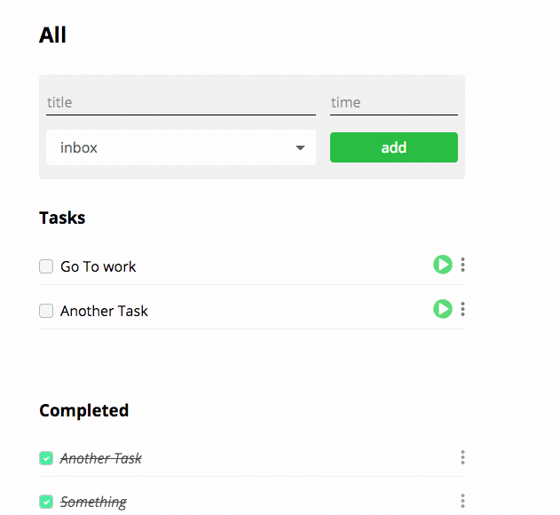
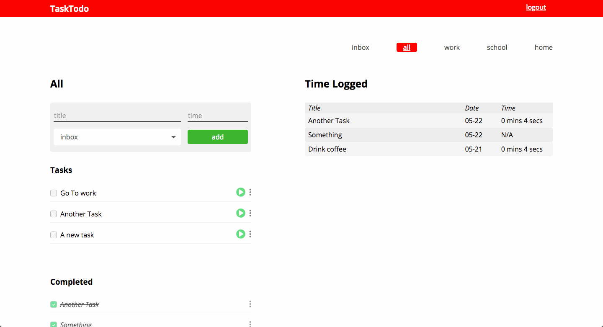

# TimeTodo

This project was bootstrapped with [Create React App](https://github.com/facebookincubator/create-react-app).

## What is it?

TaskToDo is an application where you can track your tasks and your time for those tasks.

After you signup you'll be able to track your tasks and time.

Essentially, the application is the child of a todo list and a pomodoro timer with a timelog sheet.

## Specifications

NoFuss uses a combination many tools including:

* Node
* Express
* Mongo
* PostCSS
* TailwindCSS
* Webpack
* JWTs
* React + Redux
* and more!

It also features user-protected endpoints to ensure your data is protected and only viewable to you.

## Design

TaskToDo was designed by me, [Benjamin Modayil](https://www.modayil.me) using Sketch on Mac.

Here are some screenshots of the different views in the application:

Dashboard Page

Example of Task being added

Timer Functionality w/ time added to log sheet

## Test-Drive

Want to take it for a spin? Sign into a test account with the credentials below:

* _username_: TestUser
* _password_: 1234512345
